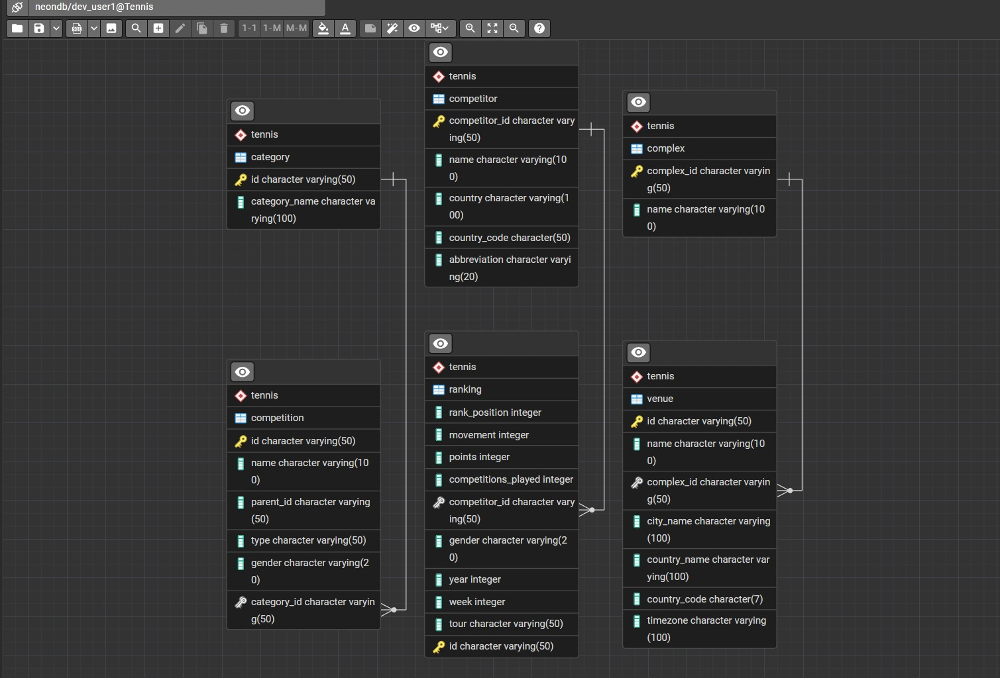

# Final Project

## Analytics Project

An end-to-end data analytics pipeline with a Streamlit dashboard for visualization and insights.

---

## 🚀 Live App

👉 https://tennis-project-analysis.streamlit.app

---

## ⚙️ Setup Instructions

### 1. Clone the repository
```bash
git clone https://github.com/PARADOXop/Final_project.git
cd Final_project
```

### 2. Setup virtual environment
```bash
bash setup.sh
```

### 3. Activate environment

**Windows (Git Bash):**
```bash
source .venv/Scripts/activate
```

**Linux/macOS:**
```bash
source .venv/bin/activate
```

---

## ▶️ Run the Application

### Main Dashboard
```bash
streamlit run app/Home.py
```

### Alternate Dashboard
```bash
streamlit run tennis_dashboard/app.py
```

---
## Data link

## 🗄️ Database Design



---

## ✨ Features

- End-to-end data pipeline (extraction → cleaning → feature engineering)
- Modular code structure (`src/`)
- Database integration and SQL queries
- Interactive dashboards using Streamlit
- Reusable utilities (charts, filters, formatters)

---

## 🔐 Environment Variables

Create a `.env` file in the root directory and add:

```env
API_KEY = ""
DB_HOST = ""
DB_USER = ""
DB_PASSWOR = ""
etc 
```

⚠️ Never commit `.env` files. Keep your credentials secure.

---

## 🛠️ Tech Stack

- Python  
- Streamlit  
- Pandas / NumPy  
- Neon Database
- SQL  
- Matplotlib / Plotly  

---

## 🚧 Future Improvements

- Add CI/CD pipeline  
- Dockerize the application  
- Improve test coverage  
- Add authentication to dashboard  
